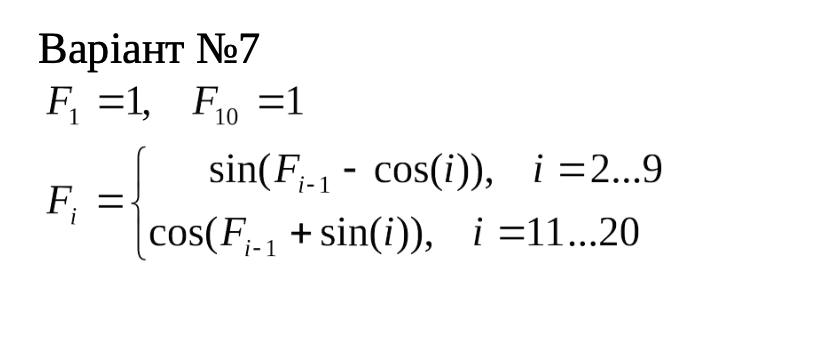

<p align="center"><b>МОНУ НТУУ КПІ ім. Ігоря Сікорського ФПМ СПіСКС</b></p>
<p align="center">
<b>Звіт з розрахунково-графічної роботи</b><br/><br/>
дисципліни "Вступ до функціонального програмування"
</p>
<p align="right"><b>Студент</b>: Кузнецов Дмитро Сергійович КВ-21</p>
<p align="right"><b>Рік</b>: 2025</p>

## Загальне завдання
1. Реалізувати програму для обчислення функції згідно варіанту мовою Common Lisp.
Варіант обирається згідно списку варіантів для лабораторних робіт за модулем 16:
1 -> 1, 2 -> 2, ..., 17 -> 1, 18 -> 2 і т.д.
2. Виконати тестування реалізованої програми.
3. Порівняти результати роботи програми мовою Common Lisp с розрахунками
іншими засобами.

## Варіант 7
<p align="center">
   
</p>

## Реалізація програми мовою Common Lisp
```lisp
(defun compute-f ()
  (let ((F (make-array 21)))
    (setf (aref F 1) 1.0)
    (setf (aref F 10) 1.0)

    (loop for i from 2 to 9 do
          (setf (aref F i)
                (sin (- (aref F (- i 1))
                        (cos i)))))

    (loop for i from 11 to 20 do
          (setf (aref F i)
                (cos (+ (aref F (- i 1))
                        (sin i)))))

    F))


(defun print-f (F)
  (loop for i from 1 to 20 do
        (format t "F[~A] = ~,15F~%" i (aref F i))))
```
## Реалізація тестових утиліт і тестових наборів.
```lisp
(defun approx-equal (a b &optional (eps 1e-6))
  (< (abs (- a b)) eps))

(defun test-initial-values ()
  (let ((F (compute-f)))
    (and
     (approx-equal (aref F 1) 1.0)
     (approx-equal (aref F 10) 1.0))))

(defun test-sample-values ()
  (let ((F (compute-f)))
    (and
     (approx-equal (aref F 2) 0.988065600000000)
     (approx-equal (aref F 16) 0.962081600000000)
     (approx-equal (aref F 11) 1)
     (approx-equal (aref F 20) 0.219496900000000))))

(defun test-array-size ()
  (let ((F (compute-f)))
    (= (length F) 21)))

(defun run-tests ()
  (format t "Test initial values: ~A~%"
          (if (test-initial-values) "PASSED" "FAILED"))
  (format t "Test sample values: ~A~%"
          (if (test-sample-values) "PASSED" "FAILED"))
  (format t "Test array size: ~A~%"
          (if (test-array-size) "PASSED" "FAILED")))

```
## Результати тестування програми
```lisp
F[1] = 1.000000000000000
F[2] = 0.988065600000000
F[3] = 0.918208840000000
F[4] = 0.999999460000000
F[5] = 0.656626600000000
F[6] = -0.298903760000000
F[7] = -0.868816000000000
F[8] = -0.661874000000000
F[9] = 0.246683270000000
F[10] = 1.000000000000000
F[11] = 1.000000000000000
F[12] = 0.894525800000000
F[13] = 0.253313030000000
F[14] = 0.321085900000000
F[15] = 0.564165800000000
F[16] = 0.962081600000000
F[17] = 0.999999760000000
F[18] = 0.969156270000000
F[19] = 0.436552230000000
F[20] = 0.219496900000000
Test initial values: PASSED
Test sample values: PASSED
Test array size: PASSED
```
## Порівняння результатів з обчисленням іншими програмними засобами або за допомогою калькулятора.
```lisp
Результати програми Common Lisp:
F[1] = 1.000000000000000
F[2] = 0.988065600000000
F[3] = 0.918208840000000
F[4] = 0.999999460000000
F[5] = 0.656626600000000
F[6] = -0.298903760000000
F[7] = -0.868816000000000
F[8] = -0.661874000000000
F[9] = 0.246683270000000
F[10] = 1.000000000000000
F[11] = 1.000000000000000
F[12] = 0.894525800000000
F[13] = 0.253313030000000
F[14] = 0.321085900000000
F[15] = 0.564165800000000
F[16] = 0.962081600000000
F[17] = 0.999999760000000
F[18] = 0.969156270000000
F[19] = 0.436552230000000
F[20] = 0.219496900000000


Результати програми Python:
F[1] = 1.000000000000000
F[2] = 0.988065581811378
F[3] = 0.918208874514690
F[4] = 0.999999442254014
F[5] = 0.656626583754967
F[6] = -0.298903772713985
F[7] = -0.868816006634113
F[8] = -0.661874009584007
F[9] = 0.246683264509397
F[10] = 1.000000000000000
F[11] = 0.999999999952044
F[12] = 0.894525791944721
F[13] = 0.253313069371307
F[14] = 0.321085922625473
F[15] = 0.564165800800523
F[16] = 0.962081607030977
F[17] = 0.999999765993239
F[18] = 0.969156255923141
F[19] = 0.436552220689785
F[20] = 0.219496988294986
```
